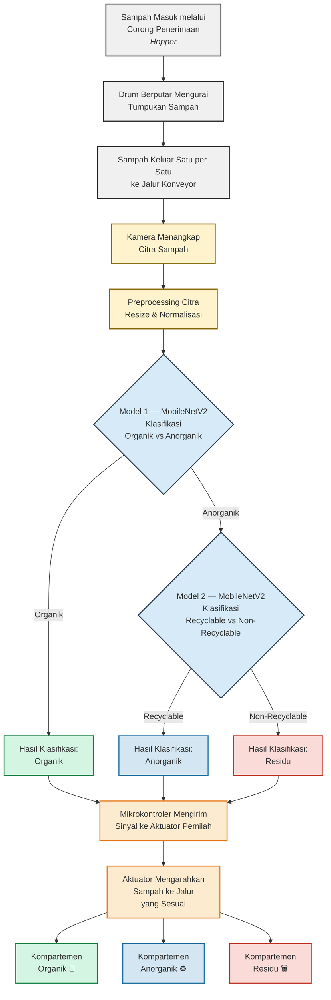

# Flowchart Sistem SEGRATRUK

```mermaid
flowchart TD
    A["Sampah Masuk melalui<br/>Corong Penerimaan<br/><i>Hopper</i>"] --> B["Drum Berputar Mengurai<br/>Tumpukan Sampah"]

    B --> C["Sampah Keluar Satu per Satu<br/>ke Jalur Konveyor"]

    C --> D["Kamera Menangkap<br/>Citra Sampah"]

    D --> E["Preprocessing Citra<br/>Resize & Normalisasi"]

    E --> F{"Model 1 — MobileNetV2<br/>Klasifikasi<br/>Organik vs Anorganik"}

    F -->|"Organik"| G["Hasil Klasifikasi:<br/>Organik"]
    F -->|"Anorganik"| H{"Model 2 — MobileNetV2<br/>Klasifikasi<br/>Recyclable vs Non-Recyclable"}

    H -->|"Recyclable"| I["Hasil Klasifikasi:<br/>Anorganik"]
    H -->|"Non-Recyclable"| J["Hasil Klasifikasi:<br/>Residu"]

    G --> K["Mikrokontroler Mengirim<br/>Sinyal ke Aktuator Pemilah"]
    I --> K
    J --> K

    K --> L["Aktuator Mengarahkan<br/>Sampah ke Jalur<br/>yang Sesuai"]

    L --> M["Kompartemen<br/>Organik 🍂"]
    L --> N["Kompartemen<br/>Anorganik ♻️"]
    L --> O["Kompartemen<br/>Residu 🗑️"]

    style A fill:#f0f0f0,stroke:#333,stroke-width:2px
    style B fill:#f0f0f0,stroke:#333,stroke-width:2px
    style C fill:#f0f0f0,stroke:#333,stroke-width:2px
    style D fill:#fff3cd,stroke:#856404,stroke-width:2px
    style E fill:#fff3cd,stroke:#856404,stroke-width:2px
    style F fill:#d6eaf8,stroke:#2c3e50,stroke-width:2px
    style G fill:#d5f5e3,stroke:#1e8449,stroke-width:2px
    style H fill:#d6eaf8,stroke:#2c3e50,stroke-width:2px
    style I fill:#d4e6f1,stroke:#2471a3,stroke-width:2px
    style J fill:#fadbd8,stroke:#c0392b,stroke-width:2px
    style K fill:#fdebd0,stroke:#e67e22,stroke-width:2px
    style L fill:#fdebd0,stroke:#e67e22,stroke-width:2px
    style M fill:#d5f5e3,stroke:#1e8449,stroke-width:2px
    style N fill:#d4e6f1,stroke:#2471a3,stroke-width:2px
    style O fill:#fadbd8,stroke:#c0392b,stroke-width:2px
```
